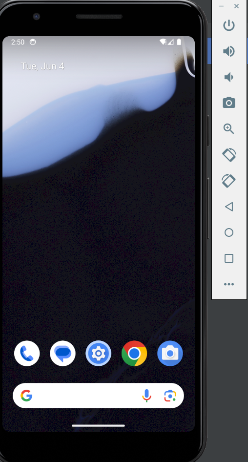
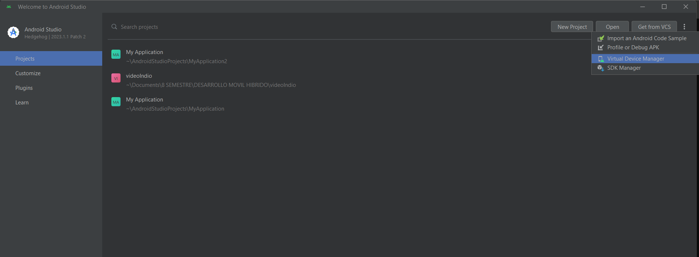
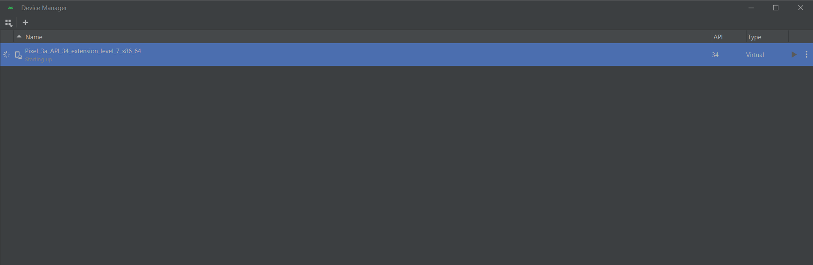

# README FRONT-END

Primeramente, lo que necesité para este proyecto fue:

- Framework React-native
- Android Studio (Emulador)
- Terminal
- Lenguaje Typescript

## Pasos de Instalación

El emulador que utilice y que estaba disponible por defecto en Android Studio es:

```
emulator -avd  Pixel_3a_API_34_extension_level_7_x86_64  
```


Empecé creando un proyecto con el framework de React-native en la terminal con el siguiente comando:
```
npx create-react-native-app videoIndio
```
Entramos a la carpeta de la siguiente manera:
```
cd videoIndio
```

Las dependecias son muy importantes, ya que nos ayudan a importar librerias de cosas que queramos implementar por ejemplo, iconos, imagenes, calendarios etc. Algunos ejemplos de dependencias que utilice son las siguientes:
```
>> npm install @react-navigation/bottom-tabs
>> npm install @react-navigation/native
>> npm install d3-shape
>> npm install react-native-reanimated
>> npm install react-native-redash
>> npm install react-native-safe-area-context
>> npm install react-native-screens
>> npm install react-native-svg
>> npm install react-native-vector-icons
>> npm install @types/d3-shape
>> npm install @types/react-native-vector-icons
```
Instalé muchas más en lo que avanzaba el proyecto pero estas son algunos ejemplos, ahora el comando para entrar al codigo en el entorno de desarollo es:
```
code .
```

Y para correrlo en el emulador el comando es:
```
npm run android
```
>Nota
>
>El emulador debe de estar prendido para que pueda correr sino manda directamente a error, una manera para activar el emulador y el que yo utilizo es abrir Android Studio e irte a la opción de **Virtual Device Manager** y luego te da la opción de correr el emulador.




Despues de dar **npm run android** en la terminal te abrirá otra y tardará un poco para poder cargar la app en el emulador.

# REPOSITORIO API BACK-END
```
https://github.com/FaGuR25/node-restful-master
```